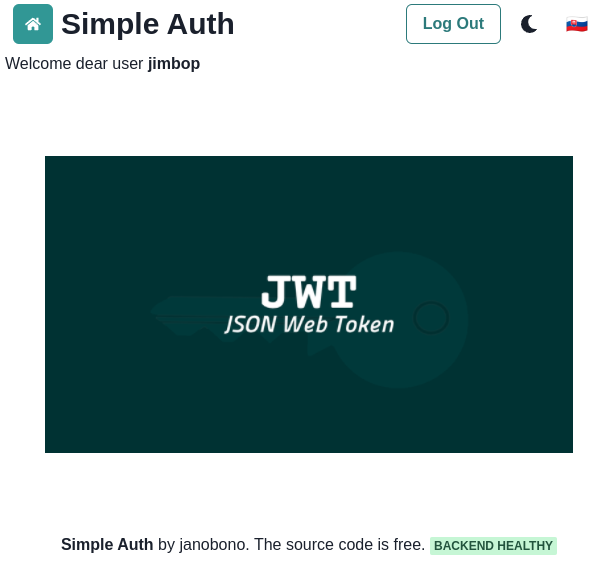

# simple auth kt

Simple JWT Auth Application, SpringBoot backend (kotlin) and React.js frontend, Docker as deployment environment.



## build

- [Docker](https://docs.docker.com/get-docker/)

```
./build.sh
```

## local run

With docker-compose.

- start:

```
docker-compose up
```

- stop:

```
docker-compose down
```

### endpoints

- [traefik](http://127.0.0.1:8080/)
- [frontend](http://127.0.0.1/)
- [backend health check](http://127.0.0.1/api/health)

### test user

If you want you can import test user with attributes:

| attribute   | value                 |
|-------------|-----------------------|
| username    | jimbop                |
| password    | pass123               |
| email       | jimbo.pytlik@test.com |
| given_name  | Jimbo                |
| family_name | Pytlik              |
| app_code    | simple-123            |

- [test_user.sql](./test_user.sql)

```
docker cp ./test_user.sql simple-auth-kt_db_1:/test_user.sql
docker exec -it simple-auth-kt_db_1 bash
psql "dbname='app' user='app' password='app' host='localhost'" -f /test_user.sql
```
